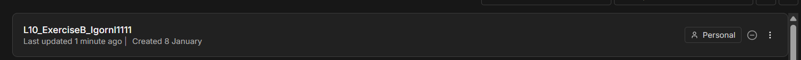
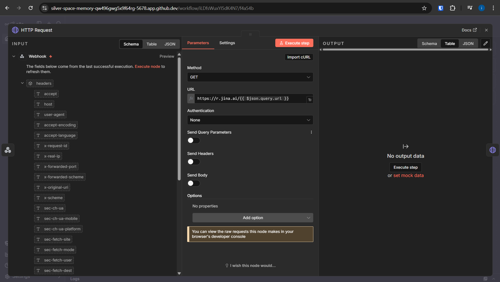
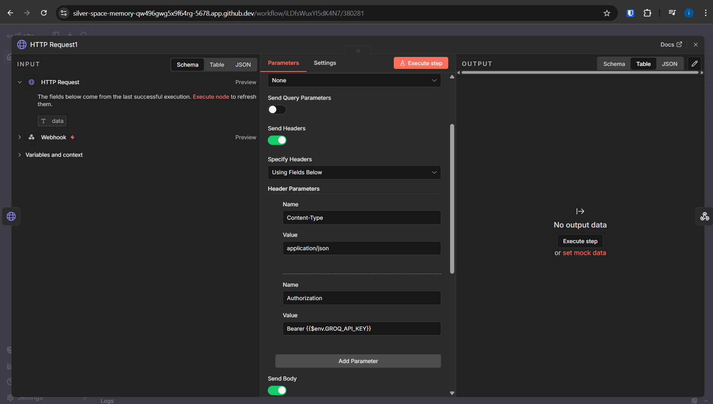
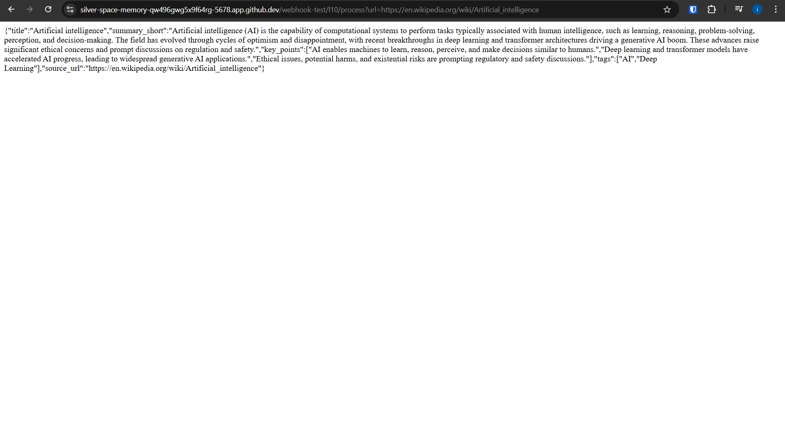

# L10 Exercise B – Webhook → Jina.ai → Groq (LLM)

## Description
I created a workflow that acts as an AI content summarizer. It accepts a URL via a Webhook, retrieves the clean page content using **Jina.ai**, and uses the **Groq API** (model `openai/gpt-oss-20b`) to structure the data into a JSON format.

**Key implementation details:**
* **Input:** Accepts a `url` parameter via GET request.
* **Processing:** The content fetched from Jina is cleaned and truncated using `.slice(0, 6000)` to fit within the model's token limits and ensure valid JSON execution.
* **Output:** Returns a structured JSON object with the title, short summary, key points, and tags.

## Screenshots

**1. Workflow Overview**
*(Visible: Named workflow and node connections)*

**2. Jina.ai Configuration**
*(Visible: HTTP Request node with dynamic URL)*

**3. Groq API Configuration**
*(Visible: HTTP Request node settings, showing the body configuration with text slicing)*

**4. Final Execution Result**
*(Visible: Browser window with the successful JSON response)*
