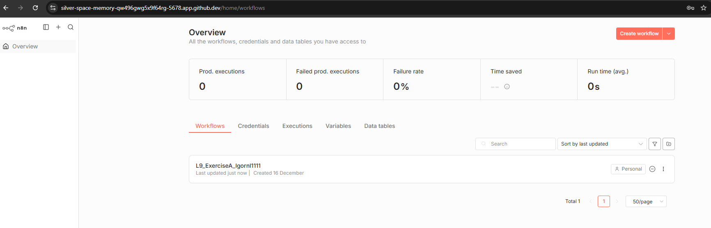
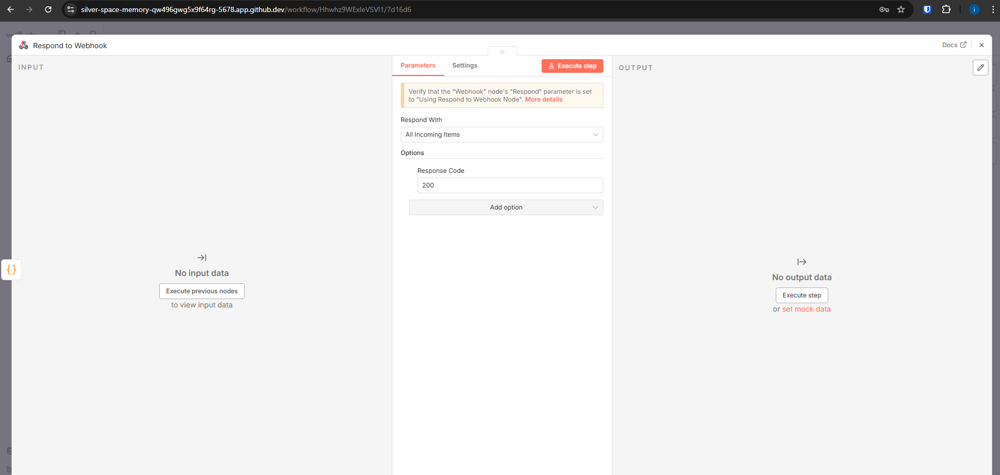
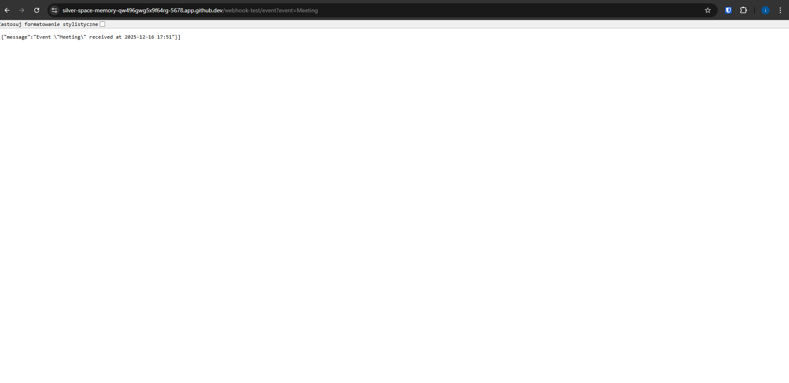

# L9 Exercise A – Webhook & Date Formatting

### Description
I created a new workflow in n8n that receives an event name via a Webhook node (GET method). I used a Code node to generate a formatted timestamp using JavaScript, and the workflow returns a JSON message using the "Respond to Webhook" node.

### Screenshots

**1. Workflow and Terminal**
*(Visible: Workflow name with my GitHub username, address bar, and Codespaces terminal)*

**2. Code Node Configuration and Webhook respond**
*(Visible: The JavaScript code settings and Webhook respond)*

**3. Final Execution Result**
*(Visible: Browser window showing the JSON response)*

