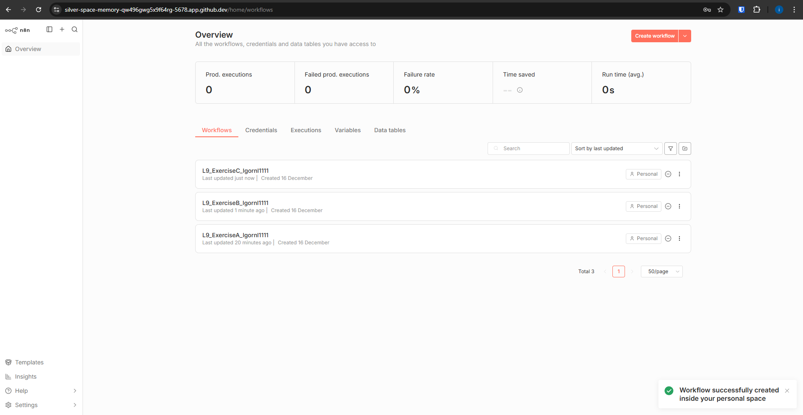
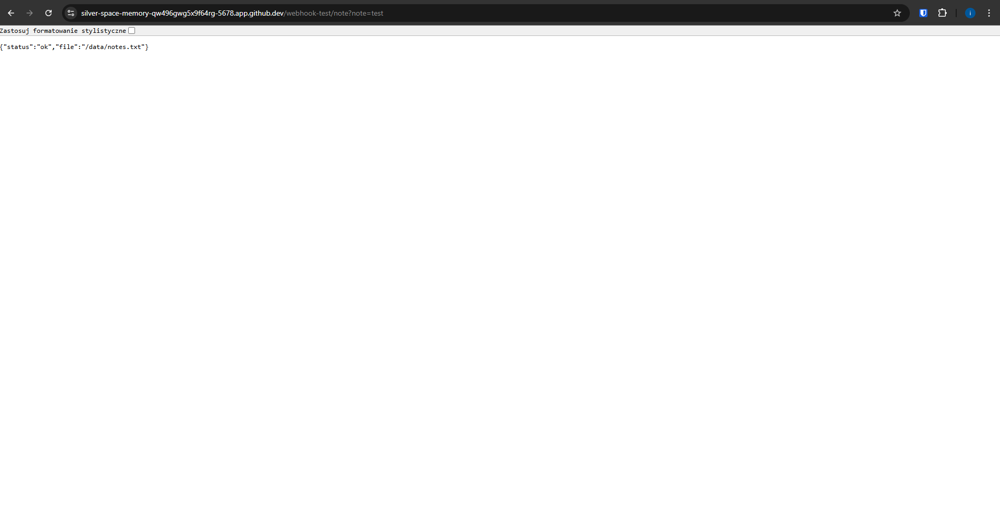

# L9 Exercise C – Save Note to File

### Description
I created a workflow that receives a text note via a Webhook (GET request). A Code node formats the note with a timestamp and converts it to binary data. Finally, a "Write Binary File" node appends this data to a local file (`./data/notes.txt`) in the Codespace.

### Screenshots

**1. Workflow and Node Configuration**
*(Visible: Workflow name, Address bar, and the Write Binary File node settings)*

**2. Write file to disk Configuration**
*(Visible: The Write file to disk settings)*

**3. Respond Node Configuration**
*(Visible: The JSON response body settings)*

**4. Workflow Execution Result**
*(Visible: Browser showing the JSON "status: ok" response)*

**5. File Verification**
*(Visible: The content of notes.txt file opened in Codespaces editor showing the appended text)*
