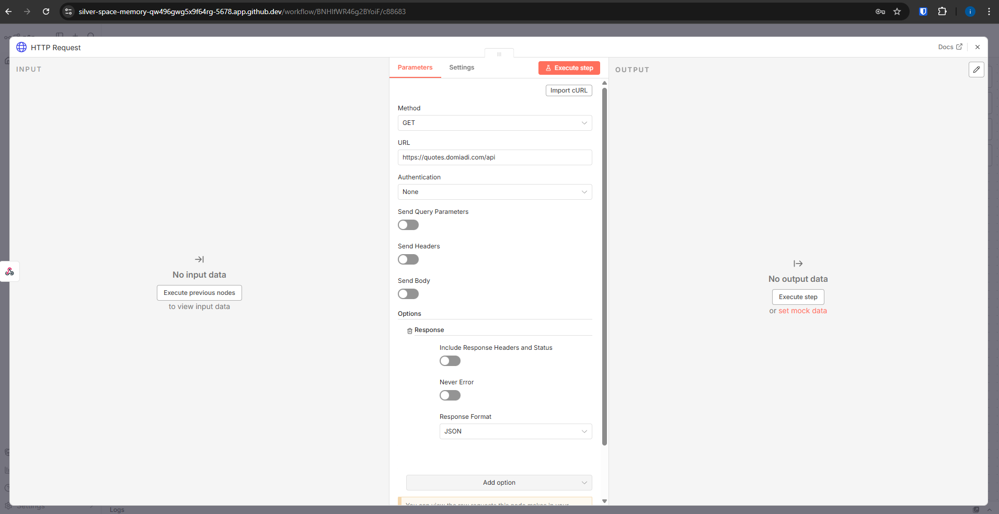
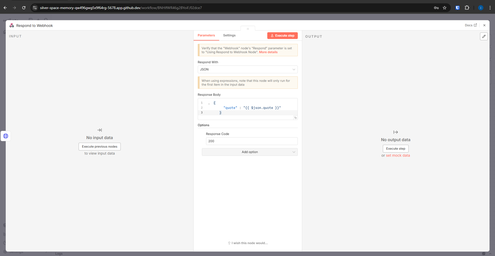

# L9 Exercise B – Random Quote API

### Description
I created an n8n workflow that uses a Webhook (GET) to trigger an HTTP Request to an external API (quotes.domiadi.com). The workflow fetches a random quote and returns it as a formatted JSON response using the "Respond to Webhook" node.

### Screenshots

**1. Workflow and Terminal**
*(Visible: Workflow name with my username, browser address bar, and terminal login)*

**2. HTTP Request Configuration**
*(Visible: The URL and GET method settings)*

**3. Respond Node Configuration**
*(Visible: The JSON response body settings)*

**4. Final Execution Result**
*(Visible: Browser window showing the JSON quote)*
